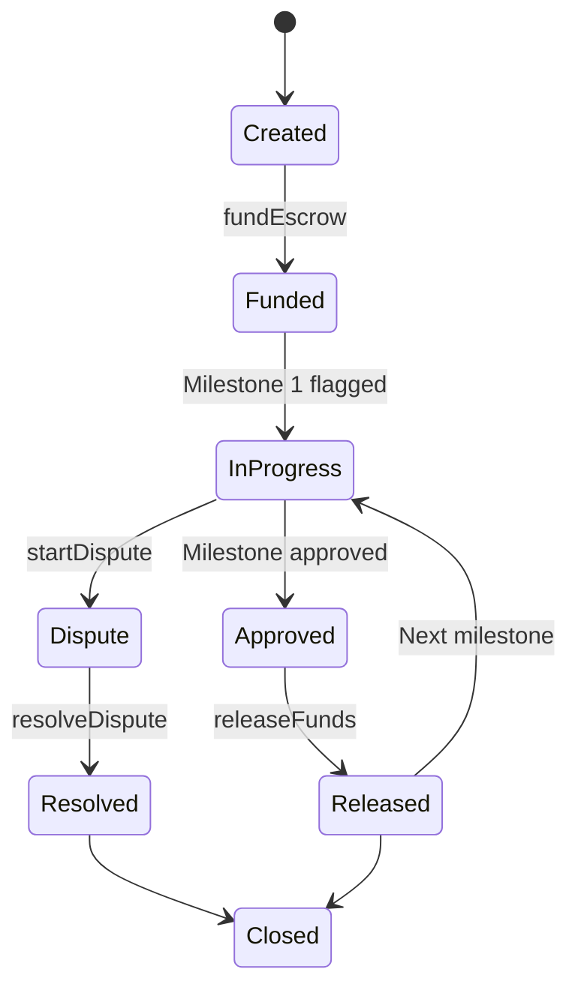

# Escrow Lifecycle

This page outlines the complete lifecycle of an escrow contract on the TrustBridge platform, from creation to completion.

## 1. Creation

- Triggered via `initializeEscrow`.
- Requires: borrower address, loan terms, milestones, approver, resolver.
- Escrow contract is deployed on Stellar using Trustless Work.

## 2. Funding

- The lender calls `fundEscrow` to deposit the loan amount.
- Funds are locked in escrow until milestone conditions are met.

## 3. Milestone Execution

- The borrower begins working on the defined deliverables.
- For each milestone:
  - The borrower flags it as complete using `changeMilestoneFlag`.
  - Approver or auto-verification confirms with `changeMilestoneStatus`.

## 4. Fund Release

- Once approved, `releaseFunds` is called to send funds to the borrower.
- This can be per milestone or in batches.

## 5. Optional Dispute

- If disagreement arises, either party calls `startDispute`.
- A resolver uses `resolveDispute` to enforce the outcome.

## 6. Escrow Completion

- After the final milestone and repayment, the escrow is closed.
- Funds are either fully released or partially refunded, depending on dispute outcomes.

## Summary Diagram

---

Next: [User Guide](user-guide.md)