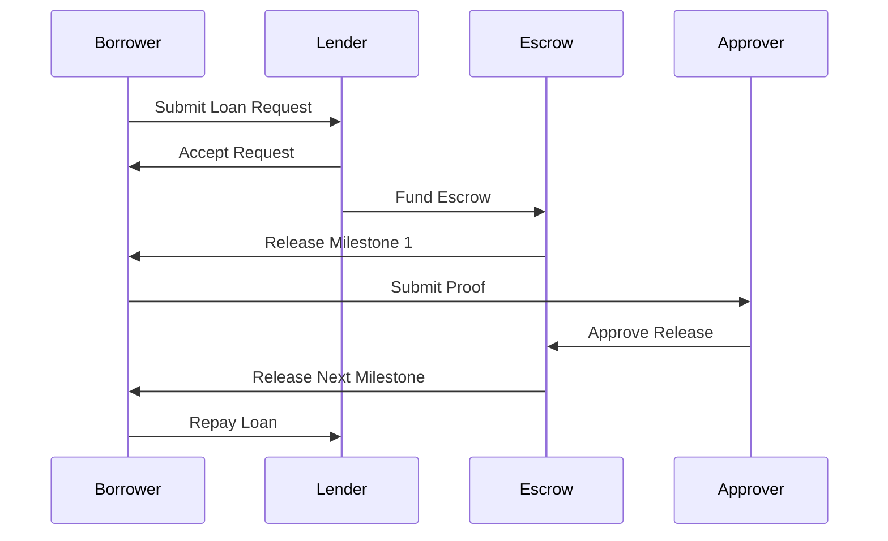

# How TrustBridge Works

TrustBridge enables decentralized lending through smart escrow contracts, ensuring a secure, transparent, and automated loan experience between two parties: the borrower and the lender.

## The Lending Process

1. **Loan Request**
   - The borrower submits a loan request with amount, purpose, duration, and milestones.
2. **Offer Matching**
   - Lenders browse open requests and submit loan offers with their conditions (interest, fees, etc.).
3. **Escrow Creation**
   - Once accepted, an escrow contract is deployed on the Stellar network, holding the lender’s funds securely.
4. **Milestone Execution**
   - As the borrower progresses, they submit evidence or completion for each milestone. The escrow releases funds in stages.
5. **Repayment**
   - The borrower repays the loan under the agreed terms. On full repayment, the escrow closes.
6. **Dispute Resolution**
   - If a disagreement arises, the Trustless Work integration can be triggered to mediate.

## Key Entities

- **Borrower:** Initiates a loan request.
- **Lender:** Reviews and accepts requests to fund.
- **Escrow Contract:** Holds and releases funds based on defined milestones.
- **Approver / Resolver:** Trusted parties or services that validate milestones or resolve disputes.

## Visual Flow

---

Next: [Architecture](architecture.md)