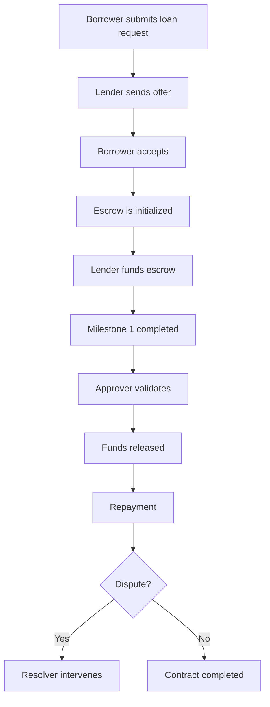

# Loan Flow

TrustBridge enables decentralized lending through a milestone-based escrow system. The loan process ensures safety and transparency for both borrowers and lenders.

## Step-by-Step Loan Lifecycle

### 1. Loan Request

- The borrower creates a loan request with purpose, amount, duration, and milestone breakdown.
- The request includes optional documents or notes.

### 2. Offer Matching

- Lenders browse the open marketplace and select a loan to fund.
- They propose terms such as interest, fees, or custom milestones.

### 3. Escrow Initialization

- Upon offer acceptance, the lender (or platform) calls `initializeEscrow`.
- All terms are locked into a smart escrow on Stellar.

### 4. Trustline & Funding

- The lender sends funds using `fundEscrow`.
- The borrower ensures trustlines are established to receive assets.

### 5. Milestone Tracking

- The borrower progresses through predefined milestones.
- Each milestone can be marked as completed (`changeMilestoneFlag`) and requires approval.

### 6. Approvals & Fund Release

- An approver or automatic logic confirms the milestone.
- The contract releases funds to the borrower (`releaseFunds`).

### 7. Repayment (Off-chain for now)

- Borrowers repay directly to the lender’s wallet or through the platform’s agreed method.

### 8. Dispute Resolution (if needed)

- Either party may call `startDispute`.
- A resolver uses `resolveDispute` to finalize the contract fairly.

## Example Flow Diagram

---

Next: [Escrow Lifecycle](escrow-lifecycle.md)
